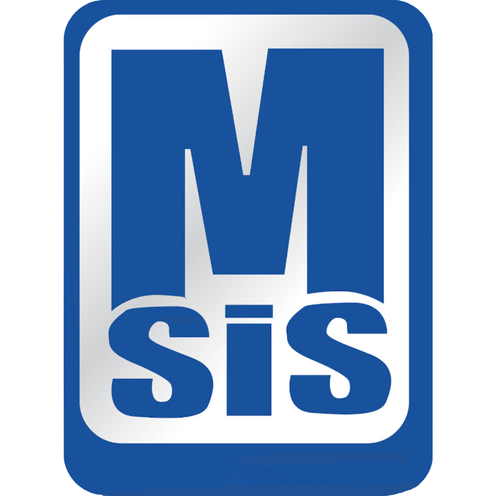
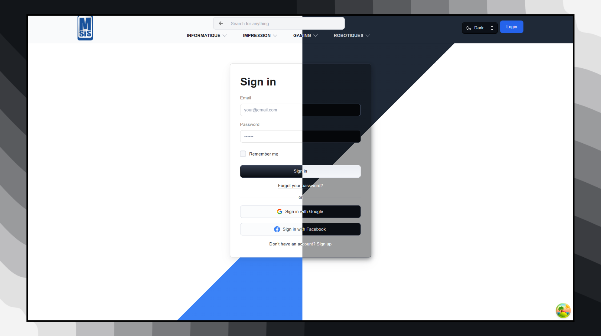

  

  <h1>MSIS - TUNISIA</h1>

  <h3>
    <a href="https://www.msis-tn.tech">
      <strong>Live Site</strong>
    </a>
  </h3>

  

    <a href="https://www.msis-tn.tech/">View website</a>
    • <a href="https://github.com/mtibaa-omar/MSIS/issues">Report Bug</a>
    • <a href="https://github.com/mtibaa-omar/MSIS/pulls">Request Feature</a>
  

  

<!-- Badges -->

  
   
  

<!-- Brief -->

  Welcome to <b>MSIS</b>! This is a full-stack e-commerce website. The application provides a seamless shopping experience with user authentication, product management, shopping cart functionality, and order processing.

<!-- Screenshot -->

## Live Site

Check out the live admin app here: [MSIS](https://www.msis-tn.tech)

## Features

## Key Features

- Secure User Authentication.
- User Profile Management: Users can update their profiles, upload avatars, and change passwords with ease.
- Admin dashboard for managing products, orders, and users
- Product listing with categories and filters
- Shopping cart functionality
- Order history and tracking
- Responsive design for all devices
- Dark Mode: Enjoy a fully functional dark mode for a personalized and comfortable user experience.

## Technologies Used

- **Frontend:** React, Redux Toolkit, Styled Components, React Router, React Hook Form , React Query, Tailwind CSS
- **Backend:** Node.js, Express.js
- **Database:** MongoDB with Mongoose
- **Authentication:** JWT (JSON Web Token) & bcrypt.js

## Installation & Setup

## Author

<b>👤 Mtibaa omar</b>

- LinkedIn - [@MtibaaOmar](https://www.linkedin.com/in/omar-mtibaa-337032327/) 

Feel free to reach out with any questions, suggestions, or feedback!
